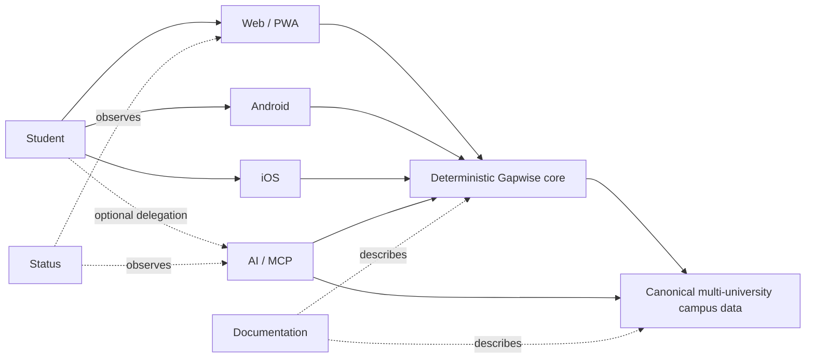

# Gapwise

### Free and open-source university timetable, campus navigation, and campus data infrastructure for students across Canada.

**Privacy-first timetable intelligence, campus maps, and day planning in one application for multiple universities.**

 

**[Gapwise](https://gapwise.ca)** · **[Android](https://github.com/GapwiseHQ/android)** · **[iOS](https://github.com/GapwiseHQ/ios)** · **[AI](https://ai.gapwise.ca)** · **[Data](https://data.gapwise.ca)** · **[Docs](https://docs.gapwise.ca)** · **[Status](https://status.gapwise.ca)**

 

**Local-first · deterministic where correctness matters · explicit about trust boundaries**

---

Gapwise turns a university timetable into a model of the day around it: **what is next, how much usable time exists between classes, where a student can realistically go, when they need to leave, and how certain the underlying campus information is.**

Gapwise supports **five universities** — University of Toronto (UTM, UTSG, UTSC), Carleton University, Toronto Metropolitan University, Queen's University, and Wilfrid Laurier University — from one canonical web application. Each university provides its own timetable adapter, campus data, and branding config. The shared app, routing engine, gap planner, and UI are not duplicated.

The web campus explorer includes source-backed building identities and footprints for all supported universities. Reviewed pedestrian routing, verified entrances, campus places, the public API, and the currently published raw-data snapshot are most complete for UTM; other campuses continue to expand.

Timetable files are parsed locally in the browser. Arithmetic, routing, travel time, gap budgets, destination feasibility, and leave-by calculations are deterministic rather than delegated to a language model.

## The ecosystem

| Repository | Owns | Surface |
| --- | --- | --- |
| **[`gapwise`](https://github.com/GapwiseHQ/gapwise)** | Core web/PWA, canonical timetable/gap/routing semantics, public API, OpenAPI, and SDK source | [gapwise.ca](https://gapwise.ca) · [api.gapwise.ca](https://api.gapwise.ca/v1) |
| **[`android`](https://github.com/GapwiseHQ/android)** | Native Kotlin + Jetpack Compose Android implementation and Android integration | Android |
| **[`ios`](https://github.com/GapwiseHQ/ios)** | Native Swift + SwiftUI iOS implementation and Apple-platform integration | iOS |
| **[`ai`](https://github.com/GapwiseHQ/ai)** | OAuth/MCP boundary for explicitly delegated student context and bounded AI actions | [ai.gapwise.ca](https://ai.gapwise.ca) |
| **[`data`](https://github.com/GapwiseHQ/data)** | Canonical public campus data, provenance, schemas, validation, and distribution | [data.gapwise.ca](https://data.gapwise.ca) |
| **[`cli`](https://github.com/GapwiseHQ/cli)** | Repeatable university scaffolding, validation, and local development | Developer tool |
| **[`docs`](https://github.com/GapwiseHQ/docs)** | Public developer documentation for APIs, SDKs, data, security, native integration, and AI/MCP | [docs.gapwise.ca](https://docs.gapwise.ca) |
| **[`status`](https://github.com/GapwiseHQ/status)** | Independent service-health monitoring and incident communication | [status.gapwise.ca](https://status.gapwise.ca) |

Organization-wide contribution, security, support, and issue defaults live in **[`.github`](https://github.com/GapwiseHQ/.github)**.

### One source of truth per responsibility

**`gapwise` owns deterministic student-day semantics and the single web application. `data` owns shared public campus facts. `cli` scaffolds integrations. `docs` documents released contracts. `status` observes public services. `android` and `ios` adapt canonical behavior to their platforms. `ai` consumes bounded context; it does not become a second timetable or routing engine.**

## Engineering principles

| | Principle | What it means |
| --- | --- | --- |
| **01** | **Privacy first** | Collect, transmit, and retain less student information. Keep trust boundaries narrow and explicit. |
| **02** | **Deterministic core** | Schedules, routes, durations, feasibility, and leave-by timing must be reproducible. |
| **03** | **Canonical facts** | Shared campus information has one owner, with provenance and visible uncertainty. |
| **04** | **Local where practical** | Keep useful functionality available without unnecessary network dependencies. |
| **05** | **Interfaces consume truth** | Web, Android, iOS, APIs, and AI should not silently recreate domain behavior. |
| **06** | **Scope stays honest** | All-campus timetable support does not imply all-campus map or routing coverage. |
| **07** | **Useful over complicated** | Architecture exists to improve a student's day, not to make the diagram larger. |

## Developer surfaces

- **API:** [`api.gapwise.ca/v1`](https://api.gapwise.ca/v1)
- **OpenAPI:** [`api.gapwise.ca/openapi.json`](https://api.gapwise.ca/openapi.json)
- **Documentation:** [`docs.gapwise.ca`](https://docs.gapwise.ca)
- **Campus data:** [`data.gapwise.ca`](https://data.gapwise.ca)
- **AI / MCP:** [`ai.gapwise.ca`](https://ai.gapwise.ca)
- **JavaScript / TypeScript SDK:** `@gapwise/sdk`
- **Python SDK:** `gapwise`
- **Security:** [`security@gapwise.ca`](mailto:security@gapwise.ca)
- **Support:** [`support@gapwise.ca`](mailto:support@gapwise.ca)

## Contributing

Choose the repository that owns the behavior you want to change. Shared contribution, security, support, and pull-request guidance lives in this organization's [`.github`](https://github.com/GapwiseHQ/.github) repository and is inherited by repositories that do not provide a more specific policy.

Campus facts and routing evidence belong in **[`data`](https://github.com/GapwiseHQ/data)**. Product behavior belongs in **[`gapwise`](https://github.com/GapwiseHQ/gapwise)**. Android-specific implementation belongs in **[`android`](https://github.com/GapwiseHQ/android)**. iOS-specific implementation belongs in **[`ios`](https://github.com/GapwiseHQ/ios)**. Public documentation belongs in **[`docs`](https://github.com/GapwiseHQ/docs)**. Keep changes focused and preserve the source-of-truth boundary.

---

**Independent student software. Not affiliated with or endorsed by the University of Toronto, Carleton University, Toronto Metropolitan University, Queen's University, or Wilfrid Laurier University.**

 

**Built for the spaces between classes.**

